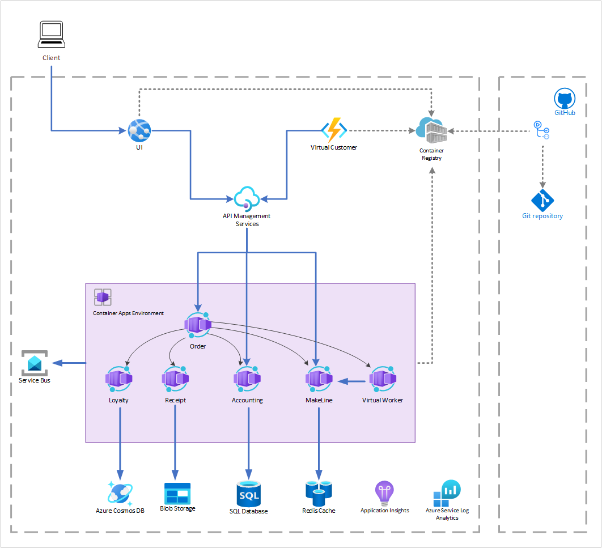

# Red Dog Demo: Azure Container Apps, Azure App Service, Azure Functions, and Azure API Management

This repository leverages the [Reddog codebase](https://github.com/Azure/reddog-code) and was created to help users deploy a comprehensive, microservice-based sample application to Azure Container Apps, Azure App Service, Azure Functions, and Azure API Management.

## Features

This project framework provides the following features:

* UI is hosted in [Azure App Service](https://azure.microsoft.com/en-us/products/app-service/)
* Virtual Customers are hosted in [Azure Functions](https://azure.microsoft.com/en-us/products/functions/)
* The rest of the micro services are hosted in [Azure Container Apps](https://azure.microsoft.com/en-us/services/container-apps/)
* Integration between the UI, Virtual Customers, and Container Apps is handled by [API Management](https://azure.microsoft.com/en-us/products/api-management/)

## Architecture

Below is the architecture  deployed in this demonstration.




### Additional Azure Services

* [Azure Service Bus](https://azure.microsoft.com/en-us/products/service-bus/)
* [Azure Cosmos Db](https://azure.microsoft.com/en-us/products/cosmos-db/)
* [Azure Blob Storage](https://azure.microsoft.com/en-us/products/storage/blobs/)
* [Azure SQL Database](https://azure.microsoft.com/en-us/products/azure-sql/database/)
* [Azure Cache for Redis](https://azure.microsoft.com/en-ca/products/cache/)
* [Azure Container Registry](https://azure.microsoft.com/en-ca/products/container-registry/)
* [Azure Monitor](https://azure.microsoft.com/en-ca/products/monitor/)

## Getting Started

### Prerequisites

1. Local bash shell with Azure CLI or [Azure Cloud Shell](https://ms.portal.azure.com/#cloudshell/)
1. Azure Subscription. [Create one for free](https://azure.microsoft.com/en-us/free/).
1. Clone or fork of this repository.

### Quickstart

```
git clone https://github.com/Azure-Samples/app-templates-eshop-on-paas.git
cd app-templates-eshop-on-paas
chmod +x ./deploy.sh
az login
az account set --subscription <subscription id>
az account show
./deploy.sh -n demo -l eastus2 -c 4f6s1d
```

### GitHub Actions

GitHub workflows are included for deploying the solution to Azure.

To run the workflows, follow these steps:

1. Create three environments
  - `Production`
  - `Test`
  - `Features` 
2. Create the following secrets
  - `AZURE_CREDENTIALS`: Follow the instructions [here](github.com/marketplace/actions/azure-login#configure-a-service-principal-with-a-secret) to login using Azure Service Principal with a secret
  - `AZURE_LOCATION`: This is the Azure location where resources will be deployed
  - `AZURE_PROJECT_NAME`: This is the name that will be appended to Azure resources
  - `AZURE_UNIQUE_CODE`: This is a unique code that will be appended to Azure resources
3. Go to [Actions](https://github.com/Azure-Samples/app-templates-eshop-on-paas/actions/)
4. Click on `Deploy Solution`
5. Click on `Run workflow`

## Benefits of this Architecture

Below are benefits and potential extension scenarios for this architecture:

1. Integrate backend systems using message broker to decouple services for scalability and reliability. 
2. Allows work to be queued when backend systems are unavailable.
3. API Management provides the publishing capability for HTTP APIs, to promote reuse and discoverability. It can manage other cross-cutting concerns such as authentication, throughput limits, and response caching.
4. Provide load leveling to handle bursts in workloads and broadcast messages to multiple consumers.

## Enhancements Opportunities

Below are opportunities for enhancements: 

1. Restrict direct traffic to Container Apps, Azure Function, and APIM (e.g. using a VNet)
2. Add WAF in front of the UI
3. Add throttling policies to APIM APIs
4. Add subscriptions, products, and authentication scenarios